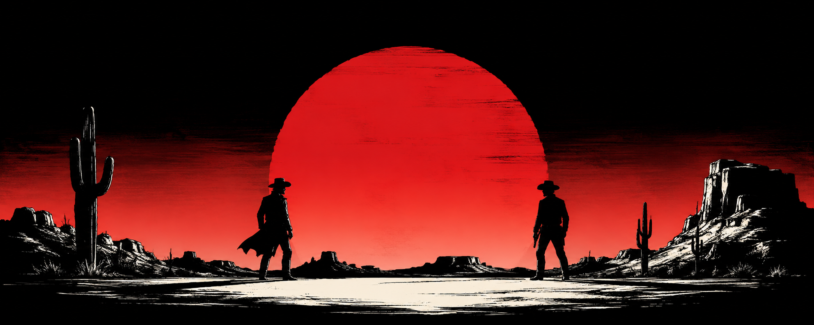
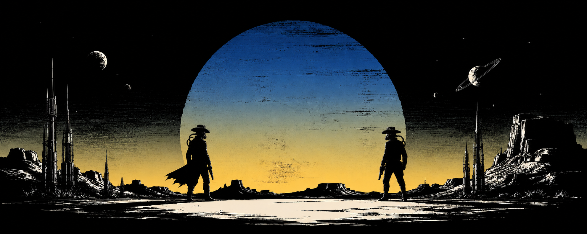
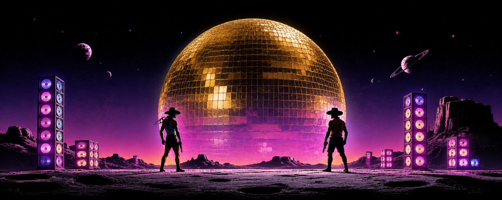
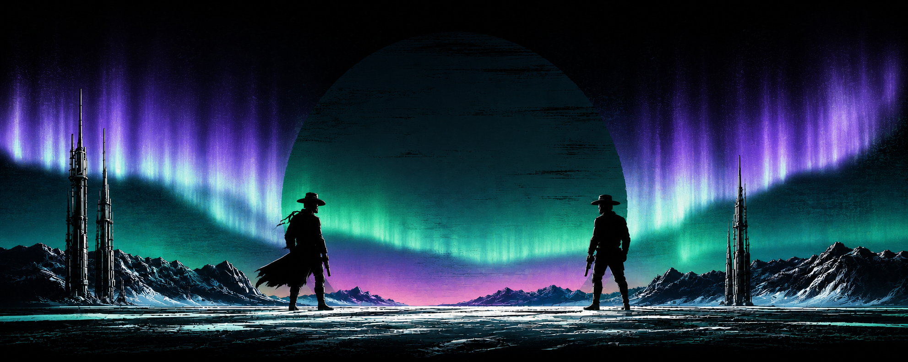
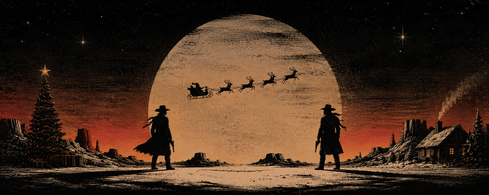
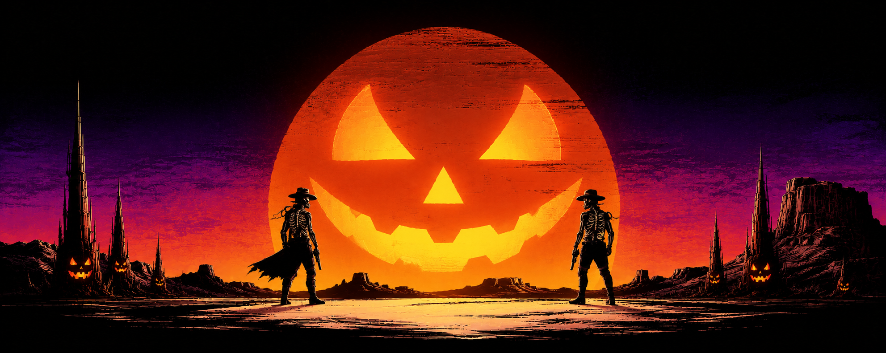
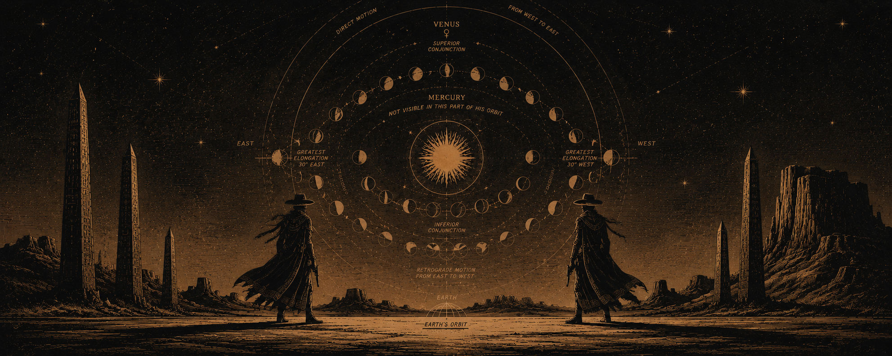
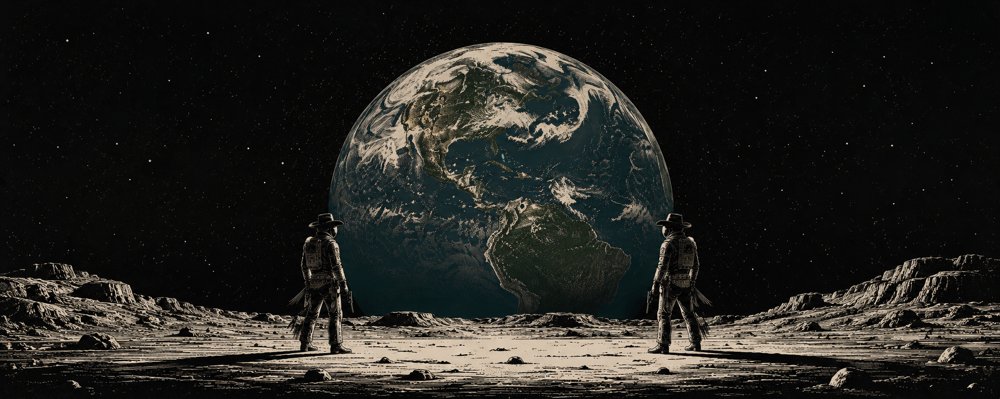

# Banner Archive

Profile banners for the saddle-notes garden. Same 2.5:1 frame (1983 × 793), same lone
cowboys, different skies — every one a standoff under something bigger than both of them.

| File | Title | Palette |
|------|-------|---------|
| `red-sun-duel.png` | Red Sun Duel | wasteland amber, blood-red sun |
| `space-cowboy.png` | Space Cowboy | deep indigo, lunar silver, alien sand |
| `neon-pride.png` | Neon Pride | disco gold, magenta, bi-pride neon — June special |
| `aurora-duel.png` | Aurora Duel | frost cyan, violet, polar neon pink |
| `christmas-duel.png` | Christmas Duel | ink black, rust red, burnt orange, amber — western frontier Christmas |
| `pumpkin-duel.png` | Pumpkin Duel | jack-o'-lantern orange, ember red, midnight violet — Halloween special |
| `star-chart-duel.png` | Star Chart Duel | antique cartography sepia, celestial gold, ink black |
| `watch-over-earth.png` | Watch Over Earth | deep-space black, sepia rock, pale earthlight |

The cowboy silhouette is the anchor of the series; the sky does the talking. Seasonal
one-offs get their own file so the archive keeps the whole family. Swap any of these
into the site header by pointing the theme's banner image at the file.

## Gallery

## Seasonal rotation

The banners rotate automatically — the cowboy stays, the sky changes with the calendar.

**Rules**

| When | Banner |
|------|--------|
| June | `neon-pride.png` (pride month) |
| October 25–31 | `pumpkin-duel.png` (halloween week) |
| December 21–27 | `aurora-duel.png` (winter solstice week — 24–25 show christmas instead) |
| December 24–25 | `christmas-duel.png` (christmas eve & day) |
| April 22 | `watch-over-earth.png` (earth day) |
| Any other day | weighted draw — red-sun 40 · space-cowboy 40 · watch-over-earth 15 · **star-chart 5** |

`star-chart-duel.png` is the hidden one: it wins the draw only ~5% of the time, so it shows up roughly a dozen days a year. Consider yourself lucky.

**How it's wired**

- **Profile README** — a GitHub Actions cron (`.github/workflows/banner-rotate.yml`) runs daily at 00:00 Asia/Shanghai. `.github/scripts/rotate_banner.py` picks the day's banner and rewrites the `` line in the profile README, committing only when the banner actually changes. The filename switch is deliberate: a new URL busts GitHub's image cache, so the swap shows up immediately instead of lingering on the old art.
- **saddle-notes site** — the same rule set runs client-side. `layouts/partials/banner.html` bundles all eight banners and swaps the `` src with a small date-seeded picker; visitors without JavaScript get the default banner. The two sides share the same seed algorithm, so profile and site agree on the same image each day.

**Adding a theme**: drop the PNG into `banners/`, add a row to the table and a line to the gallery above, then add the matching rule to `rotate_banner.py` and to the site's `banner.html` partial. That's it.
